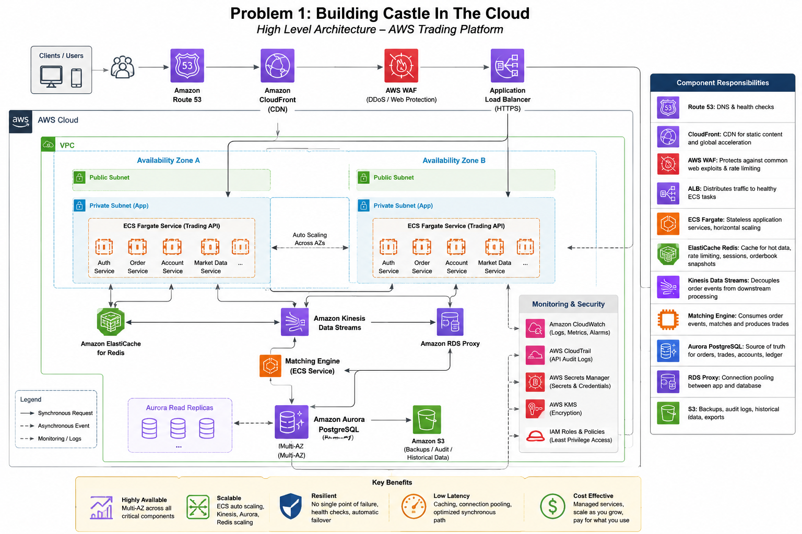

Problem 1: Building Castle in the Cloud

1. Overview

This solution proposes a highly available and scalable trading platform on AWS with features similar to a simplified Binance trading platform.

The design focuses on four core capabilities:

- User authentication and API access
- Market data retrieval
- Order creation and cancellation
- Order matching and trade processing

The initial requirements are:

Requirement| Target
Cloud Provider| AWS
Throughput| 500 requests/second
API latency| p99 < 100 ms
Availability| Highly available across Availability Zones
Scalability| Horizontal scaling
Resilience| No single point of failure
Cost| Avoid unnecessary infrastructure complexity

The architecture uses managed AWS services where possible to reduce operational overhead while keeping the system scalable and resilient.

---

2. High-Level Architecture

flowchart TB

    User[Clients / Trading Users]

    DNS[Amazon Route 53]
    CDN[CloudFront]
    WAF[AWS WAF]
    ALB[Application Load Balancer]

    subgraph AWS["AWS Region"]
        subgraph AZ1["Availability Zone A"]
            ECS1[ECS Fargate Tasks]
        end

        subgraph AZ2["Availability Zone B"]
            ECS2[ECS Fargate Tasks]
        end

        API[Trading API Services]

        Kinesis[Kinesis Data Streams]

        Match[Matching Engine]

        Redis[ElastiCache Redis]

        Proxy[RDS Proxy]

        Aurora[(Aurora PostgreSQL)]

        S3[S3 - Backups / Audit / Historical Data]

        CW[CloudWatch]
        SM[Secrets Manager]
        KMS[AWS KMS]
    end

    User --> DNS
    DNS --> CDN
    CDN --> WAF
    WAF --> ALB

    ALB --> ECS1
    ALB --> ECS2

    ECS1 --> API
    ECS2 --> API

    API --> Redis
    API --> Proxy
    API --> Kinesis

    Proxy --> Aurora

    Kinesis --> Match
    Match --> Proxy

    Aurora --> S3

    ECS1 --> CW
    ECS2 --> CW
    API --> CW
    Kinesis --> CW
    Aurora --> CW

    API --> SM
    SM --> KMS

The system is deployed across multiple Availability Zones so that failure of a single application instance or Availability Zone does not cause the entire service to become unavailable.

---

3. Design Principles

The architecture follows these principles:

3.1 High Availability

Application services run across at least two Availability Zones.

There should be no dependency on a single application instance.

3.2 Horizontal Scalability

Stateless API services can be scaled horizontally by increasing the number of ECS tasks.

3.3 Strong Consistency for Financial Data

Orders, trades, balances and the financial ledger require transactional consistency.

Aurora PostgreSQL is therefore used as the authoritative transactional database.

3.4 Asynchronous Processing

Non-critical downstream processing is decoupled from the API using Kinesis Data Streams.

Examples include:

- Market-data distribution
- Notifications
- Analytics
- Historical processing

3.5 Cache, But Do Not Trust the Cache as the Source of Truth

Redis is used to reduce latency for frequently accessed data.

Financially important state remains in Aurora.

3.6 Security by Default

The database and application services are deployed in private subnets and accessed through controlled security groups and IAM permissions.

---

4. AWS Network Architecture

I would deploy the application inside an Amazon VPC.

A simplified network structure is:

Internet
   |
Route 53
   |
CloudFront
   |
AWS WAF
   |
Internet-facing ALB
   |
------------------------------------------------
|                                              |
AZ-A                                          AZ-B
|                                              |
Public subnet                                 Public subnet
    |                                              |
   ALB                                            ALB
    |                                              |
Private subnet                                  Private subnet
    |                                              |
ECS/Fargate                                     ECS/Fargate
    \                                              /
     \                                            /
      ------------ Private Network ---------------
                         |
                  Database Subnets
                         |
                 Aurora PostgreSQL

The application and database layers should not be publicly accessible.

Security groups should restrict communication between the layers.

For example:

ALB
 |
 | HTTPS
 v
ECS
 |
 +----> Redis
 |
 +----> RDS Proxy
           |
           v
       Aurora PostgreSQL

Only the required traffic should be permitted.

---

5. Route 53

Responsibility

Amazon Route 53 provides DNS for the application.

Example:

api.example.com
www.example.com

Route 53 provides a stable endpoint while the underlying infrastructure can change.

It can also be used for health checks and routing policies if multi-region deployment is introduced later.

Alternative

Cloudflare DNS could also be used.

I would choose Route 53 initially because it integrates naturally with AWS services and keeps the infrastructure within one cloud ecosystem.

---

6. CloudFront

CloudFront is used primarily for static content and cacheable public resources.

Examples:

- Frontend JavaScript
- CSS
- Images
- Public static assets

I would not cache private trading operations such as:

POST /orders
GET /account/balance
GET /orders

because these responses are user-specific and may require fresh data.

CloudFront can reduce latency for static content and reduce traffic reaching the application layer.

Alternative

S3 can serve static assets directly, but CloudFront provides better edge delivery and caching.

---

7. AWS WAF

AWS WAF protects the public entry point from common web attacks and abusive traffic.

I would configure rules for:

- Rate limiting
- SQL injection
- Cross-site scripting
- Malicious request patterns
- Bot and abuse protection

Rate limiting is particularly important for a public trading API.

For example:

Normal client
     |
     v
    WAF
     |
     v
    ALB

An abusive client can be throttled before reaching the application.

---

8. Application Load Balancer

The Application Load Balancer distributes HTTP/HTTPS requests across healthy ECS tasks.

Example:

                 ALB
              /   |   \
             /    |    \
           ECS   ECS   ECS

The ALB performs health checks.

If an ECS task becomes unhealthy:

ECS-1 -> Healthy
ECS-2 -> Unhealthy
ECS-3 -> Healthy

traffic is automatically removed from ECS-2.

This prevents a failed application instance from receiving user requests.

---

9. ECS with AWS Fargate

I would use Amazon ECS with AWS Fargate for the application services.

The initial services could include:

Trading API
Authentication Service
Order Service
Account Service
Market Data Service

The API services should be stateless whenever possible.

For example:

                  ALB
                   |
        +----------+----------+
        |          |          |
      Task 1     Task 2     Task 3
        |          |          |
        +----------+----------+
                   |
             Shared Services

Any healthy task should be able to process a request.

This allows ECS Service Auto Scaling to add or remove tasks based on traffic and resource utilization.

Why Fargate?

Fargate removes the need to manage EC2 instances for the initial workload.

This reduces operational overhead because we do not need to manage:

- EC2 capacity
- Operating system patching
- Container hosts
- Cluster capacity planning

Alternative: EKS

Amazon EKS would be considered if:

- The organization already uses Kubernetes.
- The number of microservices becomes significantly larger.
- Advanced Kubernetes orchestration is required.
- Kubernetes expertise is already available.

For the initial 500 RPS requirement, ECS/Fargate provides a simpler operational model.

Alternative: Lambda

Lambda is useful for event-driven background jobs.

However, I would not use Lambda as the primary execution environment for the latency-sensitive trading path because the matching engine and core trading services benefit from long-running containerized processes and predictable resource allocation.

---

10. Trading API and Order Service

The API layer is responsible for receiving requests from clients.

Example:

POST /orders

Example request:

{
  "symbol": "BTC-USDT",
  "side": "BUY",
  "price": 60000,
  "quantity": 0.1
}

The Order Service performs:

1. Authentication
2. Request validation
3. Trading permission checks
4. Balance validation
5. Idempotency validation
6. Order persistence
7. Publishing the order event

The synchronous API path should be kept short to help meet the p99 <100ms requirement.

---

11. Idempotency

Idempotency is critical for order creation.

Consider this scenario:

Client
  |
  | Create order
  v
Server
  |
  | Order successfully created
  |
  X Network connection fails

The client may retry the request.

Without idempotency:

Request 1 -> Order A
Request 2 -> Order B

The user could unintentionally create two orders.

Therefore the API should support an idempotency key.

Example:

Idempotency-Key: 7b9f1c2e

The service records the relationship between the idempotency key and the resulting order.

A retry using the same key returns the original result instead of creating another order.

---

12. Matching Engine

The matching engine is responsible for matching buy and sell orders.

A simplified order book looks like:

SELL ORDERS

60,100     0.50 BTC
60,050     0.20 BTC

-------------------
     MARKET
-------------------

60,000     0.10 BTC
59,950     0.30 BTC

BUY ORDERS

The matching engine must preserve the ordering of events for a given trading pair.

For example:

BTC-USDT -> Matching Engine partition
ETH-USDT -> Matching Engine partition
SOL-USDT -> Matching Engine partition

This allows different trading pairs to be processed independently while maintaining ordering within each pair.

The matching engine should be a dedicated service rather than being implemented directly inside the HTTP API service.

---

13. Kinesis Data Streams

Amazon Kinesis Data Streams provides the event streaming layer.

Example:

Order Service
     |
     v
Kinesis Data Streams
     |
     +------> Matching Engine
     |
     +------> Market Data Consumers
     |
     +------> Notification Service
     |
     +------> Analytics

The order event can contain information such as:

{
  "eventType": "ORDER_CREATED",
  "orderId": "12345",
  "symbol": "BTC-USDT",
  "side": "BUY",
  "price": 60000,
  "quantity": 0.1
}

The trading pair can be used as the partition key.

For example:

BTC-USDT -> partition A
ETH-USDT -> partition B
SOL-USDT -> partition C

This allows events belonging to the same trading pair to maintain ordering while different trading pairs can be processed in parallel.

---

14. Why Kinesis?

Kinesis decouples producers from consumers.

Without an event stream:

API
 |
Matching Engine
 |
Database

The API is tightly coupled to the matching engine.

With Kinesis:

API
 |
Kinesis
 |
Matching Engine

the components are decoupled.

This provides several advantages:

- Independent scaling
- Failure isolation
- Event replay
- Multiple consumers
- Better handling of traffic spikes

For the initial AWS-focused assessment, Kinesis also avoids the operational overhead of managing a Kafka cluster.

Alternative: Amazon MSK / Kafka

Kafka would be a strong alternative for a large-scale event-driven trading platform.

It provides:

- Partitioning
- Consumer groups
- Durable event logs
- Replay
- A large ecosystem

I would consider MSK if the organization already has Kafka expertise or requires Kafka-specific ecosystem features.

For the initial requirement, Kinesis provides a simpler managed AWS-native solution.

---

15. Aurora PostgreSQL

Aurora PostgreSQL is the authoritative transactional database.

I would store:

- Users
- Accounts
- Orders
- Trades
- Balances
- Deposits
- Withdrawals
- Ledger entries
- Audit information

Financial operations require strong transactional guarantees, making a relational database a good fit.

For example, processing a trade may require several related operations:

BEGIN TRANSACTION

1. Create trade record
2. Update buyer balance
3. Update seller balance
4. Update order status
5. Create ledger entries

COMMIT

If any step fails:

ROLLBACK

This prevents partially completed financial operations.

---

16. Financial Ledger

The balance should not be treated as the only financial record.

I would maintain an auditable ledger.

Example:

Account 123

+1000 USDT   Deposit
-300 USDT    Trade
 +50 USDT    Trade
---------------------
=750 USDT

The ledger should be append-oriented and auditable.

This provides a reliable history for reconciliation and investigation.

The database therefore acts as the source of truth for financial state.

---

17. RDS Proxy

RDS Proxy sits between the ECS services and Aurora.

ECS Tasks
    |
    v
RDS Proxy
    |
    v
Aurora PostgreSQL

The application may have many ECS tasks, each potentially creating database connections.

RDS Proxy provides connection pooling and helps prevent connection storms from overwhelming the database.

This becomes increasingly useful as the application scales horizontally.

---

18. ElastiCache Redis

Redis is used for low-latency data that can be cached or reconstructed.

Potential use cases include:

- Market-data cache
- Instrument metadata
- Rate limiting
- Short-lived idempotency records
- Order-book snapshots
- Frequently accessed read data

Example:

Client
  |
API
  |
Redis
  |
  +-- Cache hit -> return quickly
  |
  +-- Cache miss -> query Aurora

Redis should not be the authoritative source for financial balances or the transaction ledger.

If Redis fails, the application should be able to rebuild required state from durable data.

For high availability, Redis should be deployed with replicas and automatic failover.

---

19. Amazon S3

S3 provides durable and low-cost object storage.

Use cases include:

- Database backups
- Audit exports
- Historical market data
- Application logs
- Trade history exports
- Disaster recovery artifacts
- Static frontend assets

S3 should not be placed in the synchronous order-processing path.

For example:

Order API -> Aurora

rather than:

Order API -> S3 -> Aurora

This keeps latency predictable.

---

20. Security

Security should follow the principle of least privilege.

The architecture uses:

IAM

Each service receives only the AWS permissions it requires.

For example:

Order Service
    |
    +-- Write to Order Stream
    |
    +-- Access required database
    |
    +-- Read required secret

The service should not have unrestricted administrator permissions.

Secrets Manager

Database credentials, API secrets and other sensitive values should be stored in AWS Secrets Manager rather than committed to Git.

KMS

AWS KMS can be used for encryption keys.

TLS

External API communication should use HTTPS/TLS.

Private subnets

Application and database resources should not be directly exposed to the public Internet.

CloudTrail

CloudTrail provides auditing of AWS API activity.

---

21. Observability

Amazon CloudWatch should monitor the complete system.

Important metrics include:

API request count
API p50 latency
API p95 latency
API p99 latency
HTTP 4xx
HTTP 5xx
ECS CPU
ECS memory
ALB target health
Aurora CPU
Aurora connections
Redis memory
Kinesis consumer lag

The most important application-level SLO for this assessment is:

p99 API response time < 100 ms

Example alarms:

p99 latency > 100 ms
5xx error rate > threshold
ECS CPU > threshold
ECS memory > threshold
Aurora connections > threshold
Kinesis consumer lag > threshold

Logs should be centralized in CloudWatch Logs.

For deeper distributed tracing, OpenTelemetry or AWS X-Ray can be introduced.

---

22. High Availability

The application is deployed across at least two Availability Zones.

                 ALB
               /     \
              /       \
            AZ-A      AZ-B
             |          |
           ECS        ECS
             \          /
              \        /
              Database

If one ECS task fails:

Task 1 -> FAILED
Task 2 -> HEALTHY
Task 3 -> HEALTHY

the ALB stops routing traffic to the failed task.

If an entire Availability Zone fails:

AZ-A -> FAILED

AZ-B -> continues serving traffic

The system should maintain enough capacity in the remaining Availability Zone to continue operating during the failure.

---

23. Failure Handling

The architecture explicitly assumes that individual components can fail.

ECS task failure

Mitigation:

- Multiple ECS tasks
- ALB health checks
- ECS service auto scaling
- Multi-AZ deployment

Availability Zone failure

Mitigation:

- Deploy application tasks across multiple AZs
- Multi-AZ database architecture
- Load balancing

Redis failure

Mitigation:

- Replicas
- Automatic failover
- Treat Redis as a cache rather than the source of truth

Kinesis consumer failure

Mitigation:

- Restart the consumer
- Resume processing from the appropriate checkpoint
- Make consumers idempotent
- Replay events when required

Database failure

Mitigation:

- Aurora high availability
- Automatic failover
- RDS Proxy
- Automated backups

---

24. Keeping p99 Below 100ms

The most important strategy is to keep the synchronous request path short.

The desired path is approximately:

Client
  |
  v
Route 53 / CloudFront / WAF
  |
  v
ALB
  |
  v
ECS Trading API
  |
  +----> Redis for hot data
  |
  +----> Aurora / RDS Proxy for required transactional data
  |
  v
Response

Heavy work should be asynchronous.

Examples:

- Analytics
- Notifications
- Historical aggregation
- Reporting
- Non-critical market-data processing

These workloads should not block the API response.

Database queries should also be optimized with appropriate indexes.

Example indexes:

orders(user_id, created_at)
orders(symbol, status)
trades(symbol, created_at)
ledger_entries(account_id, created_at)

Actual indexes should be confirmed through query analysis and load testing rather than added blindly.

---

25. Capacity and Load Testing

The requirement is 500 requests/second, but I would not determine infrastructure capacity from theoretical calculations alone.

The application should be load tested.

Example test stages:

100 RPS
250 RPS
500 RPS
750 RPS
1000 RPS

At each level, measure:

p50 latency
p95 latency
p99 latency
error rate
CPU
memory
database latency
database connections
Kinesis consumer lag

The acceptance criteria should include:

500 RPS
AND
p99 < 100 ms
AND
acceptable error rate

The actual number of ECS tasks should be determined from these tests.

---

26. Autoscaling

ECS Service Auto Scaling should be configured for the API layer.

For example:

Traffic increases
       |
       v
CPU / Request Count / Latency increases
       |
       v
ECS scales out
       |
       v
More application capacity

When traffic decreases:

Traffic decreases
       |
       v
ECS scales in
       |
       v
Lower infrastructure cost

The scaling thresholds should be established through load testing.

For a latency-sensitive system, request count per target and latency are useful signals in addition to CPU utilization.

---

27. Scaling Plan

Stage 1 — 500 RPS

Initial architecture:

Route 53
   |
CloudFront + WAF
   |
ALB
   |
ECS/Fargate across 2 AZs
   |
+-- Aurora PostgreSQL
+-- Redis
+-- Kinesis
+-- S3

This is sufficient for the initial assessment target assuming appropriate sizing and load testing.

---

Stage 2 — Approximately 2,500 RPS

If traffic grows approximately 5x:

ECS
 |
 +-- More tasks
 +-- Auto Scaling

Kinesis capacity should also be increased as required.

Read-heavy database workloads should be separated from write-heavy workloads.

Possible architecture:

Aurora Writer
     |
     +---- Read Replica
     |
     +---- Read Replica

Read replicas can handle suitable read workloads while the writer remains responsible for transactional writes.

Redis can also be scaled horizontally as the working set grows.

---

28. Stage 3 — Large Trading Volume

As the number of trading pairs and traffic increase, the matching workload can be partitioned by trading pair.

Example:

BTC-USDT -> Matching Engine A
ETH-USDT -> Matching Engine B
SOL-USDT -> Matching Engine C

The partition key can be the trading pair.

This allows different markets to be processed independently.

The important constraint is that each individual trading pair must maintain a deterministic ordering model.

---

29. Stage 4 — Multi-Region Disaster Recovery

I would not introduce active-active multi-region architecture for the initial 500 RPS requirement.

Multi-region infrastructure adds significant complexity around:

- Data replication
- Conflict handling
- Deployment
- Monitoring
- Failover
- Operational cost

For the initial requirement, Multi-AZ provides a better cost/reliability trade-off.

As the business grows, a second AWS Region can be introduced for disaster recovery.

A future architecture could be:

                 Route 53
                /        \
               /          \
        Region A          Region B
           |                 |
          ALB               ALB
           |                 |
          ECS               ECS
           |                 |
       Database          Database

The exact database replication and failover strategy would depend on the required Recovery Point Objective (RPO) and Recovery Time Objective (RTO).

---

30. CI/CD

The application should use an automated CI/CD pipeline.

A typical pipeline is:

Developer
    |
    v
GitHub
    |
    v
CI Pipeline
    |
    +--> Unit Tests
    |
    +--> Integration Tests
    |
    +--> Security Scanning
    |
    +--> Docker Build
    |
    v
Amazon ECR
    |
    v
ECS Deployment

The pipeline should prevent deployment if tests or security checks fail.

---

31. Deployment Strategy

For production deployments, I would prefer a blue/green or canary strategy.

Example:

                 ALB
                /   \
               /     \
        Version A   Version B
          Current       New

Initially:

Version A = 100%
Version B = 0%

The new version can then receive a small percentage of traffic.

For example:

A = 90%
B = 10%

If the new version is healthy:

A = 50%
B = 50%

Eventually:

A = 0%
B = 100%

If latency or error rates increase, traffic can be rolled back.

---

32. Alternatives Considered

Area| Selected| Alternative| Reason
Compute| ECS/Fargate| EKS| Lower operational complexity
Load Balancer| ALB| NLB| HTTP/HTTPS application makes ALB appropriate
Database| Aurora PostgreSQL| DynamoDB| Strong relational transactions are important
Cache| ElastiCache Redis| DynamoDB DAX| Redis is flexible for caching and rate limiting
Event Streaming| Kinesis| MSK/Kafka| Managed AWS-native solution with less operational overhead
DNS| Route 53| Cloudflare| Native AWS integration
CDN| CloudFront| S3 only| Better edge delivery
Security| AWS WAF| Third-party WAF| AWS-native and simpler initially
Secrets| Secrets Manager| Environment variables| Better security and secret rotation
Monitoring| CloudWatch| Datadog| Lower initial operational complexity
Containers| Fargate| EC2| No host management
Orchestration| ECS| Kubernetes/EKS| Kubernetes is unnecessary for the initial scale

---

33. Cost Optimization

The initial requirement is only 500 requests/second, so the architecture should avoid unnecessary infrastructure.

Use managed services

Managed services reduce operational work and the need for dedicated infrastructure teams.

Horizontal autoscaling

Run additional ECS tasks only when demand requires them.

Use Redis for hot reads

Caching frequently accessed data reduces pressure on Aurora.

Use S3 for historical data

S3 is more appropriate than keeping all historical data in the primary transactional database.

Start with Multi-AZ, not Multi-Region

Multi-AZ provides strong availability without the cost and operational complexity of running a second production region.

Right-size after load testing

Infrastructure sizing should be based on actual performance tests rather than over-provisioning.

---

34. Disaster Recovery

Backups should be automated.

Important data includes:

Orders
Trades
Balances
Ledger
User data
Configuration
Audit data

The recovery strategy should include:

- Automated database backups
- Point-in-time recovery where appropriate
- S3 backup storage
- Infrastructure as Code
- Tested restoration procedures
- Documented RPO/RTO

Disaster recovery should be tested rather than assumed to work.

---

35. Testing High Availability

The system should be tested against realistic failures.

Test 1 — ECS task failure

Terminate one ECS task.

Expected result:

ALB removes unhealthy task.
Other tasks continue serving traffic.

Test 2 — Availability Zone failure

Remove application capacity from one AZ.

Expected result:

Remaining AZ continues serving traffic.

Test 3 — Redis failure

Fail the Redis primary.

Expected result:

Replica takes over.
Application continues operating.

Test 4 — Kinesis consumer failure

Stop the matching-engine consumer.

Expected result:

Consumer restarts.
Unprocessed events are resumed.

Test 5 — Traffic spike

Increase traffic above 500 RPS.

Expected result:

ECS scales out.
Latency remains within the target where capacity allows.

Test 6 — Database failover

Trigger a controlled database failover in a non-production environment.

Expected result:

Application reconnects.
No permanent financial data is lost.

---

36. Final Architecture Summary

The final solution is:

Users
  |
Route 53
  |
CloudFront
  |
AWS WAF
  |
ALB
  |
  +-----------------------------+
  |                             |
AZ-A                          AZ-B
  |                             |
ECS/Fargate                  ECS/Fargate
  |                             |
  +-------------+---------------+
                |
          Trading Services
                |
       +--------+---------+
       |        |         |
     Redis   RDS Proxy  Kinesis
                |          |
                |          +----> Matching Engine
                |
          Aurora PostgreSQL
                |
                v
               S3

CloudWatch / CloudTrail / IAM / KMS / Secrets Manager

---

37. Conclusion

This architecture provides a practical starting point for a highly available trading platform on AWS.

The key decisions are:

1. ECS/Fargate provides horizontally scalable application compute without managing EC2 hosts.
2. ALB distributes requests across healthy application instances.
3. Multi-AZ deployment prevents a single Availability Zone failure from taking down the application.
4. Aurora PostgreSQL provides the transactional source of truth for orders, trades, balances and the financial ledger.
5. RDS Proxy manages database connections as the application scales.
6. ElastiCache Redis provides low-latency caching without becoming the source of truth for financial data.
7. Kinesis Data Streams decouples order events from matching and downstream processing.
8. S3 provides durable and cost-effective storage for backups and historical data.
9. WAF, IAM, KMS, Secrets Manager and private subnets provide the foundation for security.
10. CloudWatch provides monitoring and alerting around latency, errors and infrastructure health.
11. Autoscaling and partitioning allow the platform to grow beyond the initial 500 RPS.
12. Multi-region DR can be introduced later when the business requires stronger disaster recovery.

The most important design principle is to keep the financial transaction path strongly consistent and durable, while making the surrounding API, caching, event processing and market-data components horizontally scalable.

For the initial 500 RPS requirement, this provides a reasonable balance between:

Availability + Performance + Scalability + Reliability + Cost

without introducing unnecessary infrastructure complexity.